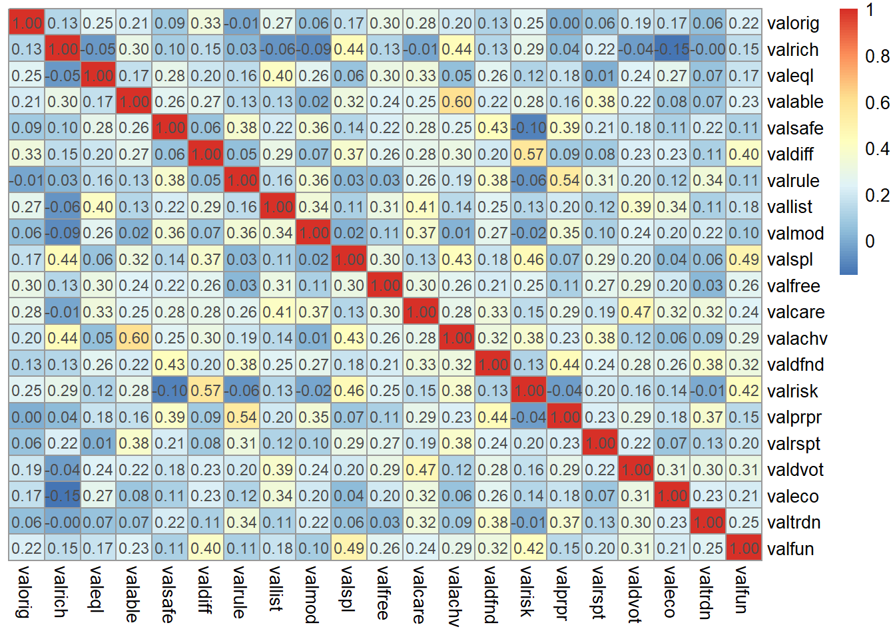

<!-- README.md is generated from README.Rmd. Please edit that file -->

# polychoric 

<!-- badges: start -->

[](https://github.com/Marwolaeth/polychoric/actions/workflows/R-CMD-check.yaml)

<!-- badges: end -->

Instant Polychoric and Polyserial Correlation

## About

Polychoric is a package that provides a wrapper for C++ routines used to
calculate polychoric and polyserial correlation coefficients, which are
often used in social science or marketing research. The
`cor_polychoric()` function can take in ordinal factor (possibly
integer) vectors, a contingency table or a data frame. It returns
corresponding polychoric correlation estimates in a form of single
numeric value or correlation matrix.

The `cor_polyserial()` takes exactly one continuous and one ordinal
vector and returns a polyserial coefficient estimate. Both functions
optionally return the p-values associated with the coefficients and
estimated discretization thresholds for ordinal variables.

## Installation

You can install the development version of polychoric from
[GitHub](https://github.com/) with:

``` r
# install.packages("devtools")
# devtools::install_github("Marwolaeth/polychoric")
```

## The Purpose

Polychoric correlation coefficients are a type of correlation
coefficient used to measure the relationship between two ordinal
variables. They are computed by estimating the correlation between two
underlying continuous variables that are assumed to give rise to the
observed ordinal data. The `cor_polychoric()` function estimates latent
Pearson correlation coefficients under the assumption that the latent
traits of interest are standard normal random variables.

Polyserial correlation is used to measure the relationship between a
continuous variable and an ordinal variable. They are computed by
estimating the correlation between the observed continuous variable and
a latent continuous variable that is derived from the observed ordinal
variable.

The computation of both polychoric and polyserial correlation
coefficients involves estimating the thresholds (here called `gamma` and
`tau`, like in ((Drasgow 2004)), or just `tau` as in `psych` package
((Revelle 2023))) that separate the ordinal categories for each
variable. These thresholds are used to transform the ordinal data into a
set of continuous variables, which can then be used to estimate the
correlation coefficient using standard methods. The `cor_polychoric()`
and `cor_polyserial()` functions currently estimate the coefficients
using a two-step maximum likelihood estimation, where first the
thresholds are deduced from univariate distributions of ordinal
variable(s) and then the `L-BFGS-B` optimization algorithm (implemented
in [LBFGS++](https://github.com/yixuan/LBFGSpp/), (Qiu 2023)) is used to
find the value of the correlation coefficient $\rho$ that maximizes the
likelihood of the observed data. The `toms462` ((Donnelly 1973), (Owen
1956))
[algorithm](https://people.sc.fsu.edu/~jburkardt/cpp_src/toms462/toms462.html)
is used to approximate the bivariate normal distribution (quadrant
probabilities) of threshold values in `cor_polychoric()`.

Polychoric and polyserial correlation coefficients are useful for
analyzing data that involve ordinal variables, such as Likert scales or
survey responses. They provide a measure of the strength and direction
of the relationship between two ordinal variables, which can be useful
for understanding patterns in the data.

## Disclaimer

Please note that the `polychoric` package was developed as a personal
project and is not intended for professional or commercial use. While
every effort has been made to ensure the accuracy and reliability of the
package, it is provided ‘as is’ without any warranty or guarantee of
suitability for any particular purpose. The package is intended
primarily as a means of exploring the direct implementation of (not so)
complex mathematical concepts, such as likelihood functions and
derivatives, and as such may not be suitable for all use cases. However,
it is hoped that others may find the package useful and informative. If
you do choose to use the `polychoric` package, please do so with an
understanding of its intended use as a personal project and with full
awareness of any limitations or potential issues.

## Example

### Data preview

``` r
library(polychoric)
library(psych)
if (!require(likert)) {
  install.packages('likert')
  library(likert)
}
data("gss12_values", package = 'polychoric')
head(gss12_values, 13)
#> # A tibble: 13 × 21
#>    valorig  valrich valeql valable valsafe valdiff valrule vallist valmod valspl
#>    <ord>    <ord>   <ord>  <ord>   <ord>   <ord>   <ord>   <ord>   <ord>  <ord> 
#>  1 Very mu… Not li… Very … Not li… Like me Very m… Not li… Very m… Very … Very …
#>  2 Somewha… A litt… Very … A litt… Like me Very m… A litt… Very m… Very … A lit…
#>  3 Like me  Not li… Like … Like me Like me A litt… Like me Like me Like … Not l…
#>  4 Somewha… Very m… Like … Not li… A litt… A litt… Like me Like me Somew… Very …
#>  5 Like me  Not li… Like … Not li… Somewh… Like me Somewh… Like me A lit… Not l…
#>  6 Very mu… Like me Very … Very m… Very m… Very m… Like me Like me Like … Very …
#>  7 Like me  Somewh… Very … Very m… Like me Like me Not li… Like me Like … Like …
#>  8 Like me  Somewh… Somew… Somewh… Somewh… Somewh… Not li… Not li… Not l… Like …
#>  9 A littl… A litt… Like … A litt… A litt… A litt… Like me Not li… A lit… A lit…
#> 10 Not lik… Not li… Very … Not li… A litt… Not li… A litt… Very m… Like … A lit…
#> 11 Somewha… Somewh… Somew… Somewh… Somewh… Somewh… Like me Like me Not l… Like …
#> 12 Somewha… Somewh… Somew… Somewh… Somewh… Somewh… A litt… Somewh… Somew… Somew…
#> 13 Somewha… Somewh… Very … A litt… Somewh… A litt… Somewh… Very m… Very … Like …
#> # ℹ 11 more variables: valfree <ord>, valcare <ord>, valachv <ord>,
#> #   valdfnd <ord>, valrisk <ord>, valprpr <ord>, valrspt <ord>, valdvot <ord>,
#> #   valeco <ord>, valtrdn <ord>, valfun <ord>
```

``` r
# likert() doesn't work with tibbles
gss12_values |> as.data.frame() |> likert() |> plot()
```


### For a pair of discrete vectors

Coefficient only:

``` r
cor_polychoric(gss12_values$valorig, gss12_values$valeql)
#> [1] 0.2368615
```

Full output:

``` r
cor_polychoric(gss12_values$valorig, gss12_values$valeql, coef.only = FALSE)
#> $rho
#> [1] 0.2368615
#> 
#> $pval
#> [1] 0
#> 
#> $gamma
#> [1] -2.0553974 -1.4868600 -0.9489826 -0.1251581  0.5555975
#> 
#> $tau
#> [1] -2.28503532 -1.90047725 -1.46900044 -0.85593837  0.01498041
```

### For a contingency table

``` r
(G <- table(gss12_values$valorig, gss12_values$valeql))
#>                     
#>                      Not like me at all Not like me A little like me
#>   Not like me at all                  3           0                1
#>   Not like me                         1           1                3
#>   A little like me                    1           2               10
#>   Somewhat like me                    3           7               15
#>   Like me                             2           8               15
#>   Very much like me                   4           4                9
#>                     
#>                      Somewhat like me Like me Very much like me
#>   Not like me at all                6       4                11
#>   Not like me                       8      22                26
#>   A little like me                 26      42                48
#>   Somewhat like me                 57     122               146
#>   Like me                          32     126               144
#>   Very much like me                28      73               245
cor_polychoric(G)
#> [1] 0.2368615
# side with psych:polychoric()
psych::polychoric(G)$rho
#> [1] "You seem to have a table, I will return just one correlation."
#> [1] 0.2390625
```

Notice that threshold values are exactly the same for both functions:

``` r
cor_polychoric(G, coef.only = FALSE)
#> $rho
#> [1] 0.2368615
#> 
#> $pval
#> [1] 0
#> 
#> $gamma
#> [1] -2.0553974 -1.4868600 -0.9489826 -0.1251581  0.5555975
#> 
#> $tau
#> [1] -2.28503532 -1.90047725 -1.46900044 -0.85593837  0.01498041
# side with psych:polychoric()
psych::polychoric(G, correct = 1e-08)
#> [1] "You seem to have a table, I will return just one correlation."
#> $rho
#> [1] 0.2368683
#> 
#> $objective
#> [1] 2.730125
#> 
#> $tau.row
#> Not like me at all        Not like me   A little like me   Somewhat like me 
#>         -2.0553974         -1.4868600         -0.9489826         -0.1251581 
#>            Like me 
#>          0.5555975 
#> 
#> $tau.col
#> Not like me at all        Not like me   A little like me   Somewhat like me 
#>        -2.28503532        -1.90047725        -1.46900044        -0.85593837 
#>            Like me 
#>         0.01498041
```

### For a data frame

``` r
cor_polychoric(gss12_values)
#>             valorig      valrich      valeql    valable     valsafe    valdiff
#> valorig 1.000000000  0.118727899  0.23686149 0.19882623  0.09122160 0.33043064
#> valrich 0.118727899  1.000000000 -0.04645770 0.31591878  0.11489494 0.15734039
#> valeql  0.236861489 -0.046457697  1.00000000 0.15255434  0.27102841 0.23579441
#> valable 0.198826227  0.315918776  0.15255434 1.00000000  0.25724803 0.26873818
#> valsafe 0.091221604  0.114894942  0.27102841 0.25724803  1.00000000 0.09667473
#> valdiff 0.330430639  0.157340388  0.23579441 0.26873818  0.09667473 1.00000000
#> valrule 0.002356917  0.037900001  0.16856652 0.11892555  0.34782606 0.07653565
#> vallist 0.265726259 -0.059919866  0.40201437 0.11889769  0.19841235 0.30571177
#> valmod  0.065341395 -0.092318870  0.27911663 0.00431537  0.33988137 0.08363167
#> valspl  0.179090630  0.423724657  0.07215105 0.34162505  0.14601642 0.37659866
#> valfree 0.297208803  0.119652724  0.27571627 0.23878197  0.23369401 0.27069457
#> valcare 0.284863397 -0.010611690  0.34551659 0.22938100  0.26178436 0.28215155
#> valachv 0.176897814  0.436578781  0.04494343 0.59889140  0.25606699 0.30619855
#> valdfnd 0.119060942  0.137882895  0.25723476 0.21626692  0.41302554 0.20515139
#> valrisk 0.242786604  0.270846009  0.13361100 0.26484849 -0.12028161 0.55059730
#> valprpr 0.004973599  0.069830218  0.19714525 0.14096472  0.37132506 0.09346525
#> valrspt 0.051196292  0.231740598 -0.01843000 0.36597910  0.22317849 0.07091980
#> valdvot 0.201466469 -0.046607247  0.24971182 0.20355778  0.18914659 0.21522228
#> valeco  0.148133027 -0.129741610  0.26659211 0.04824265  0.12134264 0.22177562
#> valtrdn 0.045333900 -0.002720963  0.10519837 0.07977575  0.22631019 0.11944924
#> valfun  0.198961969  0.158551301  0.16463518 0.23411975  0.12420461 0.40766337
#>              valrule     vallist       valmod      valspl    valfree
#> valorig  0.002356917  0.26572626  0.065341395  0.17909063 0.29720880
#> valrich  0.037900001 -0.05991987 -0.092318870  0.42372466 0.11965272
#> valeql   0.168566524  0.40201437  0.279116632  0.07215105 0.27571627
#> valable  0.118925545  0.11889769  0.004315370  0.34162505 0.23878197
#> valsafe  0.347826057  0.19841235  0.339881369  0.14601642 0.23369401
#> valdiff  0.076535649  0.30571177  0.083631673  0.37659866 0.27069457
#> valrule  1.000000000  0.17454569  0.341218252  0.03064617 0.05191878
#> vallist  0.174545692  1.00000000  0.351268411  0.09785445 0.31528897
#> valmod   0.341218252  0.35126841  1.000000000 -0.01567523 0.12093125
#> valspl   0.030646174  0.09785445 -0.015675228  1.00000000 0.30570996
#> valfree  0.051918784  0.31528897  0.120931247  0.30570996 1.00000000
#> valcare  0.241301604  0.41987814  0.346280470  0.13626551 0.30733023
#> valachv  0.169349875  0.14078039  0.029046367  0.44698453 0.25879039
#> valdfnd  0.384303748  0.24238726  0.263548607  0.17267243 0.21402072
#> valrisk -0.053650113  0.14249683 -0.006674191  0.44832716 0.25301084
#> valprpr  0.520358756  0.19754954  0.373712528  0.09281485 0.08336381
#> valrspt  0.278185722  0.10438393  0.059494292  0.27570734 0.25155888
#> valdvot  0.212123748  0.37380957  0.215858371  0.18862366 0.29329799
#> valeco   0.120073095  0.33163867  0.198688457  0.04656644 0.21025500
#> valtrdn  0.329400314  0.13710998  0.232702487  0.10459957 0.06616966
#> valfun   0.105557503  0.16972583  0.063512491  0.48110530 0.27333191
#>             valcare    valachv   valdfnd      valrisk      valprpr     valrspt
#> valorig  0.28486340 0.17689781 0.1190609  0.242786604  0.004973599  0.05119629
#> valrich -0.01061169 0.43657878 0.1378829  0.270846009  0.069830218  0.23174060
#> valeql   0.34551659 0.04494343 0.2572348  0.133611002  0.197145248 -0.01843000
#> valable  0.22938100 0.59889140 0.2162669  0.264848486  0.140964722  0.36597910
#> valsafe  0.26178436 0.25606699 0.4130255 -0.120281615  0.371325056  0.22317849
#> valdiff  0.28215155 0.30619855 0.2051514  0.550597303  0.093465247  0.07091980
#> valrule  0.24130160 0.16934988 0.3843037 -0.053650113  0.520358756  0.27818572
#> vallist  0.41987814 0.14078039 0.2423873  0.142496832  0.197549540  0.10438393
#> valmod   0.34628047 0.02904637 0.2635486 -0.006674191  0.373712528  0.05949429
#> valspl   0.13626551 0.44698453 0.1726724  0.448327163  0.092814851  0.27570734
#> valfree  0.30733023 0.25879039 0.2140207  0.253010842  0.083363810  0.25155888
#> valcare  1.00000000 0.27259763 0.3336151  0.167791356  0.271697223  0.19858149
#> valachv  0.27259763 1.00000000 0.3258523  0.359208775  0.227881733  0.38756143
#> valdfnd  0.33361510 0.32585232 1.0000000  0.120536665  0.424709519  0.22222162
#> valrisk  0.16779136 0.35920878 0.1205367  1.000000000 -0.013974051  0.16479278
#> valprpr  0.27169722 0.22788173 0.4247095 -0.013974051  1.000000000  0.22202503
#> valrspt  0.19858149 0.38756143 0.2222216  0.164792782  0.222025030  1.00000000
#> valdvot  0.44608286 0.12198850 0.2639067  0.163152896  0.286130764  0.21683784
#> valeco   0.31674033 0.05029329 0.2487177  0.129998877  0.175597155  0.06206173
#> valtrdn  0.31352715 0.09149786 0.3670784 -0.005258625  0.383678397  0.13390411
#> valfun   0.21246223 0.27783825 0.3053171  0.430985534  0.153299415  0.17792237
#>             valdvot      valeco      valtrdn     valfun
#> valorig  0.20146647  0.14813303  0.045333900 0.19896197
#> valrich -0.04660725 -0.12974161 -0.002720963 0.15855130
#> valeql   0.24971182  0.26659211  0.105198375 0.16463518
#> valable  0.20355778  0.04824265  0.079775750 0.23411975
#> valsafe  0.18914659  0.12134264  0.226310194 0.12420461
#> valdiff  0.21522228  0.22177562  0.119449236 0.40766337
#> valrule  0.21212375  0.12007310  0.329400314 0.10555750
#> vallist  0.37380957  0.33163867  0.137109984 0.16972583
#> valmod   0.21585837  0.19868846  0.232702487 0.06351249
#> valspl   0.18862366  0.04656644  0.104599569 0.48110530
#> valfree  0.29329799  0.21025500  0.066169657 0.27333191
#> valcare  0.44608286  0.31674033  0.313527147 0.21246223
#> valachv  0.12198850  0.05029329  0.091497862 0.27783825
#> valdfnd  0.26390674  0.24871768  0.367078389 0.30531709
#> valrisk  0.16315290  0.12999888 -0.005258625 0.43098553
#> valprpr  0.28613076  0.17559716  0.383678397 0.15329941
#> valrspt  0.21683784  0.06206173  0.133904109 0.17792237
#> valdvot  1.00000000  0.32678791  0.323819049 0.28988487
#> valeco   0.32678791  1.00000000  0.239031822 0.17905717
#> valtrdn  0.32381905  0.23903182  1.000000000 0.24959307
#> valfun   0.28988487  0.17905717  0.249593069 1.00000000
```

Let’s visualise and compare our matrices. We suggest `pheatmap` package
for quick correlation matrix visualisation. `corrplot` is also a good
option.

``` r
if (!require(pheatmap)) {
  install.packages('pheatmap')
  library(pheatmap)
}
rho1 <- cor_polychoric(gss12_values)
# psych::polychoric() doesn't work with factor data directly
gss_num <- gss12_values |> lapply(as.integer) |> as.data.frame()
rho2 <- polychoric(gss_num)
pheatmap(
  rho2$rho,
  cluster_rows = FALSE,
  cluster_cols = FALSE,
  display_numbers = TRUE,
  number_format = '%.2f',
  fontsize_number = 9
)
```

<div class="figure">


<p class="caption">
psych correlation matrix
</p>

</div>

``` r
pheatmap(
  rho1,
  cluster_rows = FALSE,
  cluster_cols = FALSE,
  display_numbers = TRUE,
  number_format = '%.2f',
  fontsize_number = 9
)
```

<div class="figure">


<p class="caption">
polychoric correlation matrix
</p>

</div>

### Handling mixed variable types

The `cor_polychoric()` function is currently limited in its flexibility
as it only provides polychoric estimation for ordinal variables and does
not support biserial or polyserial estimation for mixed ordinal and
continuous variables. The function does, however, attempt to recognise
potentially non-discrete variables, allowing for up to 10 levels, like
in [World Values Survey](https://www.worldvaluessurvey.org/wvs.jsp)
(Gedeshi et al. 2021) questionnaire items. In comparison, the
`polychoric()` function from the `psych` package allows up to 8 levels
by default.

It’s worth noting that variables with a high number of distinct values
may cause estimation issues, so the `cor_polychoric()` function returns
Spearman’s $\rho$ instead (with a warning).

``` r
x <- rnorm(nrow(gss12_values))
cor_polychoric(gss12_values$valspl, x)
#> [1] 0.03159122
```

### Polyserial correlation

Alternatively, one can correlate a continuous and an ordinal variable
explicitly using polyserial correlation. The `polychoric` package
contains `cor_polyserial()` function that estimates polyserial
correlation coefficients between a continuous and an ordinal variable.

``` r
# Let them be actually correlated
x <- as.integer(gss12_values$valspl) * 20.2 + rnorm(nrow(gss12_values), sd = 13)
cor(x, as.integer(gss12_values$valspl))
#> [1] 0.9089471
cor_polyserial(x, gss12_values$valspl)
#> [1] 0.9227912
```

Due to its strong bivariate normality assumptions, `cor_polyserial()`
is currently not a default choice for a mixed continuous-ordinal
variable correlation.

### Handling missing values

The `cor_polychoric()` function always uses pairwise complete
observations. Therefore, the user need not worry about missing data.
However, depending on the analysis design and the ratio of missing data,
it may be essential to check for patterns of missingness and consider
imputation.

The General Social Survey Schwartz Values Module dataset (Smith,
Marsden, and Hout 2014) is cleared of missing values (non-response or
non-applicable). Here we introduce some NAs into random places across
the dataset. The summary will show the dataset now actually contains
missings.

``` r
gss_miss <- gss12_values
mask <- matrix(
  sample(
    c(TRUE, FALSE),
    nrow(gss_miss)*ncol(gss_miss),
    replace = TRUE,
    prob = c(.9, .1)
  ),
  nrow = nrow(gss_miss)
)
gss_miss[!mask] <- NA
summary(gss_miss[,1:4]) # Now NAs are present
#>                valorig                  valrich                   valeql   
#>  Not like me at all: 19   Not like me at all:182   Not like me at all: 14  
#>  Not like me       : 56   Not like me       :446   Not like me       : 20  
#>  A little like me  :114   A little like me  :221   A little like me  : 47  
#>  Somewhat like me  :309   Somewhat like me  :148   Somewhat like me  :142  
#>  Like me           :292   Like me           : 70   Like me           :344  
#>  Very much like me :323   Very much like me : 55   Very much like me :554  
#>  NA's              :142   NA's              :133   NA's              :134  
#>                valable   
#>  Not like me at all: 44  
#>  Not like me       :185  
#>  A little like me  :196  
#>  Somewhat like me  :275  
#>  Like me           :241  
#>  Very much like me :182  
#>  NA's              :132
```

Let’s rerun the estimation: the function works, though coefficients may
be different.

``` r
pheatmap(
  cor_polychoric(gss_miss),
  cluster_rows = FALSE,
  cluster_cols = FALSE,
  display_numbers = TRUE,
  number_format = '%.2f',
  fontsize_number = 9
)
```



## Performance

Probably the only reason the `polychoric` package may be useful is that
it is fast. During alpha-testing of the source code, it was nearly 50x
faster in creating a correlation matrix than the gold standard
`psych::polychoric()`. The package version is 5 times slower than the
raw source code. However, `polychoric` still introduces a significant
improvement in performance and can save a market researcher a couple of
minutes a day.

``` r
if (!require(microbenchmark)) {
  install.packages('microbenchmark')
  library(microbenchmark)
}
bm <- microbenchmark(
  polychoric = polychoric(gss_num),
  cor_polychoric = cor_polychoric(gss12_values),
  times = 13L,
  control = list(warmup = 2)
)
bm
#> Unit: milliseconds
#>            expr       min        lq      mean    median        uq       max
#>      polychoric 2399.6845 2425.4384 2444.8269 2444.7262 2463.0100 2491.4847
#>  cor_polychoric  181.4081  182.2151  183.2385  183.3385  183.9289  185.2803
#>  neval cld
#>     13  a 
#>     13   b
```

Another minor advantage of the `polychoric` package is that its
functions accept ordinal factor variables without need to convert them
explicitly.

## Development

This is an alpha version of the package. It is under development.

Please report any issues you came up with on the
[issues](https://github.com/Marwolaeth/polychoric/issues) page.

<details>
<summary>
The upcoming steps
</summary>

1.  Implement (optional) more robust distributional assumptions, e.g. a
    skew normal distribution ((Jin and Yang-Wallentin 2016)).

</details>

<div id="refs" class="references csl-bib-body hanging-indent">

<div id="ref-donnelly1973" class="csl-entry">

Donnelly, Thomas G. 1973. “Algorithm 462: Bivariate Normal
Distribution.” *Communications of the ACM* 16 (10): 638.
<https://doi.org/10.1145/362375.362414>.

</div>

<div id="ref-drasgow2004" class="csl-entry">

Drasgow, Fritz. 2004. “Polychoric and Polyserial Correlations,” October.
<https://doi.org/10.1002/0471667196.ess2014>.

</div>

<div id="ref-gedeshi2021" class="csl-entry">

Gedeshi, Ilir, Merab Pachulia, David Rotman, Sylvia Kritzinger, Georg
Poghosyan, Georgy Fotev, Jadranka Kolenović-apo, et al. 2021. “Joint
EVS/WVS 2017-2021 Dataset (Joint EVS/WVS).” World Values Survey
Association. <https://doi.org/10.14281/18241.11>.

</div>

<div id="ref-jin2016" class="csl-entry">

Jin, Shaobo, and Fan Yang-Wallentin. 2016. “Asymptotic Robustness Study
of the Polychoric Correlation Estimation.” *Psychometrika* 82 (1):
67–85. <https://doi.org/10.1007/s11336-016-9512-2>.

</div>

<div id="ref-owen1956" class="csl-entry">

Owen, Donald B. 1956. “Tables for Computing Bivariate Normal
Probabilities.” *The Annals of Mathematical Statistics* 27 (4): 1075–90.
<https://doi.org/10.1214/aoms/1177728074>.

</div>

<div id="ref-LBFGSpp" class="csl-entry">

Qiu, Yixuan. 2023. “LBFGS++: A Header-Only c++ Library for l-BFGS and
l-BFGS-b Algorithms.”

</div>

<div id="ref-psych" class="csl-entry">

Revelle, William. 2023. “Psych: Procedures for Psychological,
Psychometric, and Personality Research.”
<http://personality-project.org/r/psych/>.

</div>

<div id="ref-smith2014" class="csl-entry">

Smith, Tom W., Peter V. Marsden, and Michael Hout. 2014. “General Social
Survey, 2012 Merged Data, Including a Cultural Module \[United
States\].” ICPSR - Interuniversity Consortium for Political; Social
Research. <https://doi.org/10.3886/ICPSR35478.V4>.

</div>

</div>
