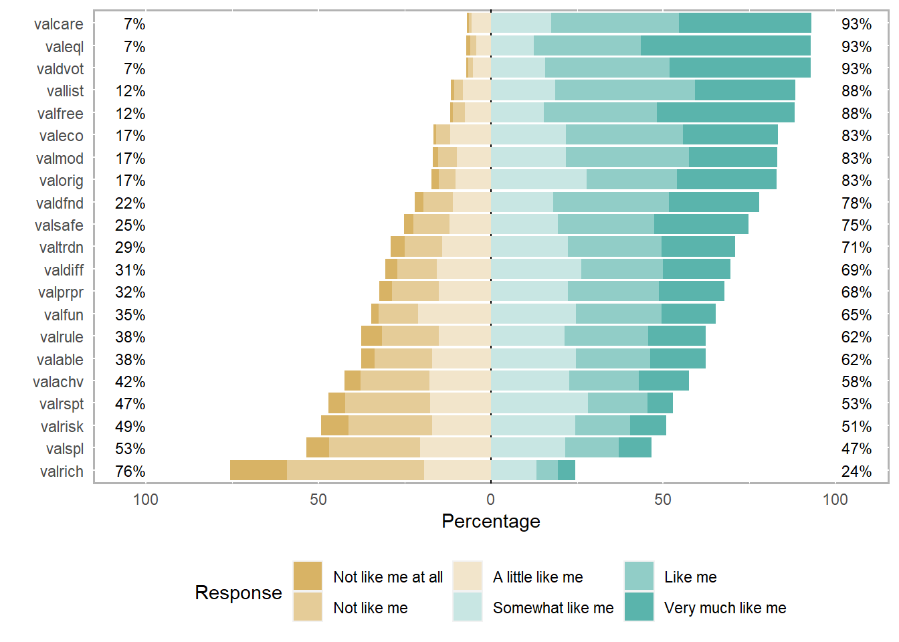

<!-- README.md is generated from README.Rmd. Please edit that file -->

# polychoric

<!-- badges: start -->
<!-- badges: end -->

Fast Polychoric Correlation for Vectors and Data Frames

## Installation

You can install the development version of polychoric from
[GitHub](https://github.com/) with:

``` r
# install.packages("devtools")
devtools::install_github("Marwolaeth/polychoric")
```

## About

Polychoric is a package that provides a wrapper for C++ routines used to
calculate polychoric correlation coefficients, which are often used in
social science or marketing research. The single `polycorr()` function
can take in ordinal factor vectors, a contingency table, or a data frame
and returns corresponding polychoric correlation estimates in the form
of a single numeric value or a correlation matrix.

<details>
<summary>
Spoiler
</summary>
*Pathetic amateurish craftsmanship*
</details>

## The Purpose

Polychoric correlation coefficients are a type of correlation
coefficient used to measure the relationship between two ordinal
variables. They are computed by estimating the correlation between two
underlying continuous variables that are assumed to give rise to the
observed ordinal data. The `polycorr()` function estimates latent
Pearson correlation coefficients under the assumption that the latent
traits of interest are standard normal random variables.

The computation of polychoric correlation coefficients involves
estimating the thresholds (here called `gamma` and `tau`, like in
(*Drasgow 1986*), or just `tau` as in `psych` package (*Revelle 2023*))
that separate the ordinal categories for each variable. These thresholds
are used to transform the ordinal data into a set of continuous
variables, which can then be used to estimate the correlation
coefficient using standard methods. The `polycorr()` function currently
estimates the thresholds using a two-step maximum likelihood estimation,
where first the thresholds are deduced from univariate distributions of
ordinal variables and then the `L-BFGS-B` optimization algorithm
(implemented in [LBFGS++](https://github.com/yixuan/LBFGSpp/), *Yixuan
2023*) is used to find the value of the correlation coefficient $\rho$
that maximizes the likelihood of the observed contingency table. The
`toms462` (*Donnelly 1973*, *Owen 1956*)
[algorithm](https://people.sc.fsu.edu/~jburkardt/cpp_src/toms462/toms462.html)
is used to approximate the bivariate normal distribution (quadrant
probabilities) of threshold values.

Polychoric correlation coefficients are useful for analyzing data that
involve ordinal variables, such as Likert scales or survey responses.
They provide a measure of the strength and direction of the relationship
between two ordinal variables, which can be useful for understanding
patterns in the data.

## Example

### Data preview

``` r
library(polychoric)
if (!require(likert)) {
  install.packages('likert')
  library(likert)
}
#> Loading required package: likert
#> Loading required package: ggplot2
#> Loading required package: xtable
data("gss12_values", package = 'polychoric')
head(gss12_values, 13)
#> # A tibble: 13 × 21
#>    valorig  valrich valeql valable valsafe valdiff valrule vallist valmod valspl
#>    <ord>    <ord>   <ord>  <ord>   <ord>   <ord>   <ord>   <ord>   <ord>  <ord> 
#>  1 Very mu… Not li… Very … Not li… Like me Very m… Not li… Very m… Very … Very …
#>  2 Somewha… A litt… Very … A litt… Like me Very m… A litt… Very m… Very … A lit…
#>  3 Like me  Not li… Like … Like me Like me A litt… Like me Like me Like … Not l…
#>  4 Somewha… Very m… Like … Not li… A litt… A litt… Like me Like me Somew… Very …
#>  5 Like me  Not li… Like … Not li… Somewh… Like me Somewh… Like me A lit… Not l…
#>  6 Very mu… Like me Very … Very m… Very m… Very m… Like me Like me Like … Very …
#>  7 Like me  Somewh… Very … Very m… Like me Like me Not li… Like me Like … Like …
#>  8 Like me  Somewh… Somew… Somewh… Somewh… Somewh… Not li… Not li… Not l… Like …
#>  9 A littl… A litt… Like … A litt… A litt… A litt… Like me Not li… A lit… A lit…
#> 10 Not lik… Not li… Very … Not li… A litt… Not li… A litt… Very m… Like … A lit…
#> 11 Somewha… Somewh… Somew… Somewh… Somewh… Somewh… Like me Like me Not l… Like …
#> 12 Somewha… Somewh… Somew… Somewh… Somewh… Somewh… A litt… Somewh… Somew… Somew…
#> 13 Somewha… Somewh… Very … A litt… Somewh… A litt… Somewh… Very m… Very … Like …
#> # ℹ 11 more variables: valfree <ord>, valcare <ord>, valachv <ord>,
#> #   valdfnd <ord>, valrisk <ord>, valprpr <ord>, valrspt <ord>, valdvot <ord>,
#> #   valeco <ord>, valtrdn <ord>, valfun <ord>
```

``` r
gss12_values |> as.data.frame() |> likert() |> plot()
```



### For a pair of discrete vectors

Coefficient only:

``` r
polycorr(gss12_values$valorig, gss12_values$valeql)
#> [1] 0.2373013
```

Full output:

``` r
polycorr(gss12_values$valorig, gss12_values$valeql, coef.only = FALSE)
#> $rho
#> [1] 0.2373013
#> 
#> $pval
#> [1] 0
#> 
#> $gamma
#> [1] -2.0537489 -1.4862570 -0.9486693 -0.1249568  0.5558306
#> 
#> $tau
#> [1] -2.28503532 -1.89926319 -1.46841315 -0.85565031  0.01518016
```

### For a contingency table

``` r
#### A contingency table ----
(G <- table(gss12_values$valorig, gss12_values$valeql))
#>                     
#>                      Not like me at all Not like me A little like me
#>   Not like me at all                  3           0                1
#>   Not like me                         1           1                3
#>   A little like me                    1           2               10
#>   Somewhat like me                    3           7               15
#>   Like me                             2           8               15
#>   Very much like me                   4           4                9
#>                     
#>                      Somewhat like me Like me Very much like me
#>   Not like me at all                6       4                11
#>   Not like me                       8      22                26
#>   A little like me                 26      42                48
#>   Somewhat like me                 57     122               146
#>   Like me                          32     126               144
#>   Very much like me                28      73               245
polycorr(G)
#> [1] 0.2373013
```

### For a data frame

``` r
polycorr(gss12_values)
#>             valorig      valrich      valeql     valable     valsafe    valdiff
#> valorig 1.000000000  0.118727899  0.23720932 0.198826228  0.09122160 0.33009188
#> valrich 0.118727899  1.000000000 -0.04670283 0.314855307  0.11449561 0.15734039
#> valeql  0.237209319 -0.046702826  1.00000000 0.152347685  0.27109827 0.23579441
#> valable 0.198826228  0.314855307  0.15234769 1.000000000  0.25724803 0.26873818
#> valsafe 0.091221604  0.114495612  0.27109827 0.257248028  1.00000000 0.09667473
#> valdiff 0.330091881  0.157340389  0.23579441 0.268738180  0.09667473 1.00000000
#> valrule 0.002356917  0.037900004  0.16856652 0.118925545  0.34782606 0.07653565
#> vallist 0.265863725 -0.060131075  0.40205032 0.118897693  0.19851827 0.30572543
#> valmod  0.065341396 -0.092318870  0.27979906 0.004315369  0.33988137 0.08395914
#> valspl  0.179090630  0.422710781  0.07215105 0.341625050  0.14601642 0.37659866
#> valfree 0.297702063  0.117488273  0.27639313 0.238781963  0.23355602 0.27087017
#> valcare 0.284574168 -0.012780705  0.34613377 0.229023494  0.26225173 0.28156361
#> valachv 0.176897814  0.435748809  0.04550866 0.598242106  0.25606699 0.30619855
#> valdfnd 0.119524864  0.137466455  0.25764576 0.215812607  0.41302554 0.20515139
#> valrisk 0.242389857  0.270846010  0.13361100 0.264848486 -0.12028162 0.54997437
#> valprpr 0.005499929  0.069487853  0.19758133 0.140964722  0.37132506 0.09346525
#> valrspt 0.051196292  0.231740596 -0.01843000 0.365979099  0.22261496 0.07091980
#> valdvot 0.202168094 -0.048163892  0.25121898 0.202937085  0.18972724 0.21528460
#> valeco  0.148632767 -0.129771959  0.26685311 0.048357793  0.12169972 0.22177562
#> valtrdn 0.045813505 -0.002720963  0.10519838 0.079775750  0.22631019 0.11944924
#> valfun  0.198961969  0.157957458  0.16463518 0.234119747  0.12420461 0.40766337
#>              valrule     vallist       valmod      valspl    valfree    valcare
#> valorig  0.002356917  0.26586373  0.065341396  0.17909063 0.29770206  0.2845742
#> valrich  0.037900004 -0.06013107 -0.092318870  0.42271078 0.11748827 -0.0127807
#> valeql   0.168566524  0.40205032  0.279799058  0.07215105 0.27639313  0.3461338
#> valable  0.118925545  0.11889769  0.004315369  0.34162505 0.23878196  0.2290235
#> valsafe  0.347826058  0.19851827  0.339881370  0.14601642 0.23355602  0.2622517
#> valdiff  0.076535649  0.30572543  0.083959141  0.37659866 0.27087017  0.2815636
#> valrule  1.000000000  0.17422736  0.341218252  0.03064617 0.05171472  0.2408288
#> vallist  0.174227365  1.00000000  0.351686462  0.09780635 0.31545940  0.4203815
#> valmod   0.341218252  0.35168646  1.000000000 -0.01567523 0.12230657  0.3460787
#> valspl   0.030646174  0.09780635 -0.015675227  1.00000000 0.30443727  0.1354547
#> valfree  0.051714718  0.31545940  0.122306570  0.30443727 1.00000000  0.3079972
#> valcare  0.240828785  0.42038151  0.346078695  0.13545468 0.30799718  1.0000000
#> valachv  0.169349875  0.14026398  0.029387129  0.44698453 0.25853954  0.2718955
#> valdfnd  0.384303749  0.24300727  0.263776908  0.17267243 0.21428278  0.3335383
#> valrisk -0.053650113  0.14192225 -0.006674191  0.44832716 0.25180118  0.1661776
#> valprpr  0.520076905  0.19754954  0.373712529  0.09281485 0.08451273  0.2716698
#> valrspt  0.278185722  0.10379211  0.059494292  0.27570734 0.25023311  0.1974274
#> valdvot  0.212508588  0.37434998  0.216969234  0.18836975 0.29333998  0.4469105
#> valeco   0.120073096  0.33165855  0.198905933  0.04656649 0.21108989  0.3167773
#> valtrdn  0.329400314  0.13744877  0.232702487  0.10459957 0.06650694  0.3133155
#> valfun   0.105557504  0.16963226  0.063512491  0.48045909 0.27297785  0.2120011
#>            valachv   valdfnd      valrisk      valprpr     valrspt     valdvot
#> valorig 0.17689781 0.1195249  0.242389857  0.005499929  0.05119629  0.20216809
#> valrich 0.43574881 0.1374665  0.270846010  0.069487853  0.23174060 -0.04816389
#> valeql  0.04550866 0.2576458  0.133611002  0.197581331 -0.01843000  0.25121898
#> valable 0.59824211 0.2158126  0.264848486  0.140964722  0.36597910  0.20293708
#> valsafe 0.25606699 0.4130255 -0.120281615  0.371325057  0.22261496  0.18972724
#> valdiff 0.30619855 0.2051514  0.549974372  0.093465247  0.07091980  0.21528460
#> valrule 0.16934988 0.3843037 -0.053650113  0.520076905  0.27818572  0.21250859
#> vallist 0.14026398 0.2430073  0.141922249  0.197549540  0.10379211  0.37434998
#> valmod  0.02938713 0.2637769 -0.006674191  0.373712529  0.05949429  0.21696923
#> valspl  0.44698453 0.1726724  0.448327164  0.092814851  0.27570734  0.18836975
#> valfree 0.25853954 0.2142828  0.251801180  0.084512731  0.25023311  0.29333998
#> valcare 0.27189555 0.3335383  0.166177580  0.271669779  0.19742740  0.44691052
#> valachv 1.00000000 0.3258523  0.359208776  0.227881733  0.38756144  0.12221508
#> valdfnd 0.32585232 1.0000000  0.120536665  0.424709520  0.22164851  0.26399440
#> valrisk 0.35920878 0.1205367  1.000000000 -0.013974051  0.16479278  0.16231741
#> valprpr 0.22788173 0.4247095 -0.013974051  1.000000000  0.22202503  0.28593528
#> valrspt 0.38756144 0.2216485  0.164792783  0.222025031  1.00000000  0.21605148
#> valdvot 0.12221508 0.2639944  0.162317413  0.285935279  0.21605148  1.00000000
#> valeco  0.05029329 0.2486996  0.129843903  0.175608805  0.06210243  0.32745212
#> valtrdn 0.09149786 0.3670784 -0.005258625  0.383678398  0.13390411  0.32365933
#> valfun  0.27783825 0.3053171  0.430377570  0.153299415  0.17792231  0.28939373
#>              valeco      valtrdn     valfun
#> valorig  0.14863277  0.045813505 0.19896197
#> valrich -0.12977196 -0.002720963 0.15795746
#> valeql   0.26685311  0.105198375 0.16463518
#> valable  0.04835779  0.079775750 0.23411975
#> valsafe  0.12169972  0.226310195 0.12420461
#> valdiff  0.22177562  0.119449236 0.40766337
#> valrule  0.12007310  0.329400314 0.10555750
#> vallist  0.33165855  0.137448766 0.16963226
#> valmod   0.19890593  0.232702487 0.06351249
#> valspl   0.04656649  0.104599569 0.48045909
#> valfree  0.21108989  0.066506938 0.27297785
#> valcare  0.31677728  0.313315503 0.21200108
#> valachv  0.05029329  0.091497862 0.27783825
#> valdfnd  0.24869962  0.367078389 0.30531709
#> valrisk  0.12984390 -0.005258625 0.43037757
#> valprpr  0.17560881  0.383678398 0.15329942
#> valrspt  0.06210243  0.133904109 0.17792231
#> valdvot  0.32745212  0.323659328 0.28939373
#> valeco   1.00000000  0.239031823 0.17905717
#> valtrdn  0.23903182  1.000000000 0.24959307
#> valfun   0.17905717  0.249593070 1.00000000
```

### Handling mixed variable types

The `polycorr()` function is currently limited in its flexibility as it
only provides polychoric estimation for ordinal variables and does not
support biserial or polyserial estimation for mixed ordinal and
continuous variables. The function does, however, attempt to recognise
potentially non-discrete variables, allowing for up to 10 levels. In
comparison, the `polychoric()` function from the `psych` package allows
up to 8 levels by default.

It’s worth noting that variables with a high number of distinct values
may cause estimation issues, so the `polycorr()` function returns
Spearman’s $\rho$ instead (with a warning).

``` r
x <- rnorm(nrow(gss12_values))
polycorr(gss12_values$valspl, x)
#> Warning in .poly_xy(x, y, correct = correct): Too many levels or continuous
#> input: returning Spearman's rho
#> [1] 0.009500079
```

## Development

This is an alpha version of the package. It is under development.

Please report any issues you came up with on the
[issues](https://github.com/Marwolaeth/polychoric/issues) page.

<details>
<summary>
The upcoming steps
</summary>

1.  Optimise `Polychoric` class in the source code.
2.  Provide a polyserial correlation estimation function.
3.  Implement (optional) more robust distributional assumptions, e.g. a
    skew normal distribution (*Jin and Yang-Wallentin 2017*).
    </details>

## References

1.  Drasgow, Fritz (1986). Polychoric and polyserial correlations. The
    Encyclopedia of Statistics. 7. 68-74.

2.  Revelle, William (2023). *psych: Procedures for Psychological,
    Psychometric, and Personality Research*. Northwestern University,
    Evanston, Illinois. R package version 2.3.3,
    <https://CRAN.R-project.org/package=psych>.

3.  Olsson, Ulf (1979). Maximum Likelihood Estimation of the Polychoric
    Correlation Coefficient, Psychometrika, 44:443-460.

4.  Donnelly, Thomas (1973). Algorithm 462: Bivariate Normal
    Distribution, Communications of the ACM, October 1973, Volume 16,
    Number 10, page 638.

5.  Owen, Donald (1956). Tables for Computing Bivariate Normal
    Probabilities, Annals of Mathematical Statistics, December 1956,
    Volume 27, Number 4, pages 1075-1090.

6.  Qiu, Yixuan (2023). LBFGS++: A Header-only C++ Library for L-BFGS
    and L-BFGS-B Algorithms. Available at: <https://lbfgspp.statr.me/>

7.  Jin S, Yang-Wallentin F (2017). Asymptotic Robustness Study of the
    Polychoric Correlation Estimation. Psychometrika. 2017
    Mar;82(1):67-85.
